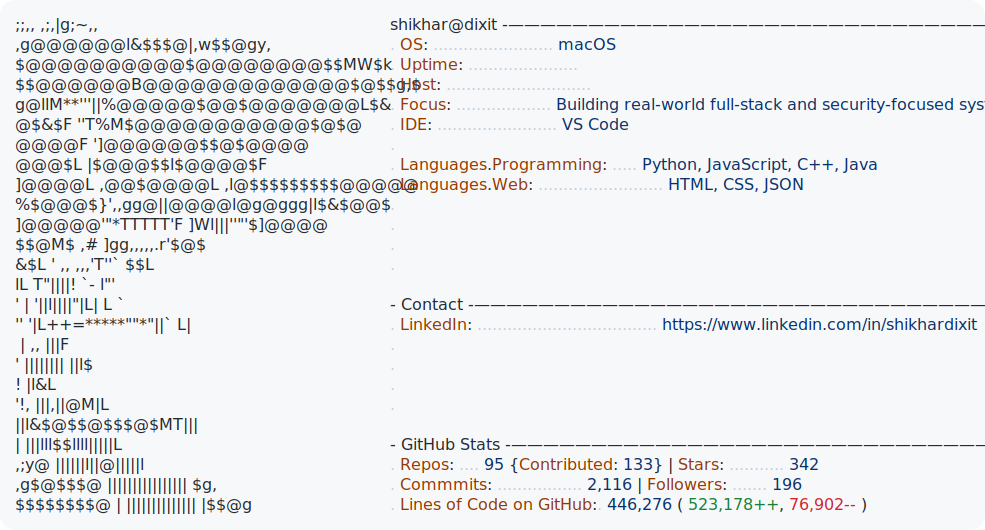

<!-- Profile README scaffold -->

  <picture>
    <source media="(prefers-color-scheme: dark)" srcset="dark_mode.svg">
    <source media="(prefers-color-scheme: light)" srcset="light_mode.svg">
    
  </picture>

